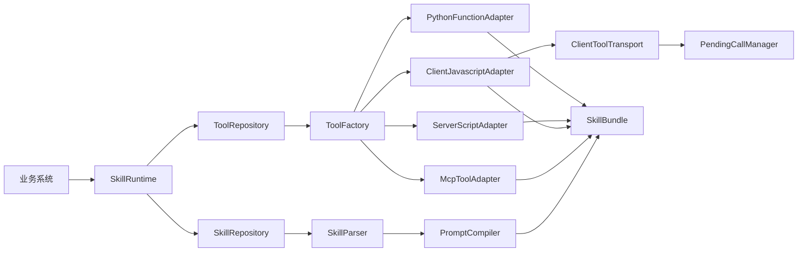

# 技能运行时工具库设计文档

## 一、文档信息

- 编制日期：2026-08-10
- 文档状态：已确认
- 项目路径：`/Users/zqs/PycharmProjects/AI/langchain-skill-runtime`
- 项目形态：使用 uv 管理的、数据库无关的 Python 类库
- 目标框架：LangChain

## 二、建设目标

本项目解决一个 Skill 同时依赖多种类型 Tool 的运行时装配问题。业务系统传入 Skill 标识和编译上下文后，工具库完成以下转换：

```text
SKILL.md + Skill-Tool 关系 + ToolDefinition
                       ↓
           SkillRuntime.compile()
                       ↓
          system_prompt + BaseTool[]
                       ↓
              LangChain Agent
```

第一版必须支持以下 Tool 类型：

1. `PYTHON_FUNCTION`：调用服务端已注册的 Python Function。
2. `SERVER_SCRIPT`：委派给受控的服务端脚本执行器。
3. `CLIENT_JAVASCRIPT`：通过 Transport 委派给客户端，并异步等待执行结果。
4. `MCP`：连接 MCP Server，发现并转换指定工具。

## 三、核心设计结论

### 3.1 Skill、Tool 和 Executor 分层

- `SKILL.md` 保存 Skill 的名称、描述、使用规则和业务指令。
- Skill-Tool 关系决定当前 Skill 实际绑定哪些工具。
- `ToolDefinition.tool_type` 决定使用哪个 ToolAdapter。
- ToolAdapter 将不同执行类型统一转换为 LangChain `BaseTool`。
- Executor、Transport 和 MCP Client 承担真实执行。
- LangChain Agent 只能选择已经装配的 Tool 和业务参数，不能决定脚本路径、客户端位置、MCP 凭据或执行入口。

### 3.2 工具绑定的可信来源

Skill-Tool 关系和 ToolDefinition 是执行配置的唯一可信来源。`SKILL.md` 中的 `allowed-tools` 作为兼容信息和诊断依据读取，但不能单独创建可执行工具。

若 `allowed-tools` 声明了未绑定工具，编译器生成诊断信息；若数据库绑定了工具但文档未声明，仍以绑定关系为准，并生成提示性诊断。

### 3.3 编译与执行分离

核心库负责校验和编译，不直接实现业务脚本、不管理客户端 WebSocket 服务，也不持有模型实例和对话历史。业务系统通过协议注入 Repository、Executor、Transport、Function Registry 和 Secret Provider。

## 四、总体架构



## 五、项目结构

```text
langchain-skill-runtime/
├── pyproject.toml
├── uv.lock
├── README.md
├── doc/
│   └── 技能运行时工具库设计文档.md
├── src/langchain_skill_runtime/
│   ├── __init__.py
│   ├── diagnostics.py
│   ├── errors.py
│   ├── models/
│   ├── repositories/
│   ├── parsing/
│   ├── prompting/
│   ├── schemas/
│   ├── adapters/
│   ├── executors/
│   ├── client/
│   └── runtime/
└── tests/
    ├── fixtures/skills/heterogeneous-tools/SKILL.md
    ├── unit/
    └── integration/
```

项目使用 uv 的类库模板和 `src` 布局，Python 版本要求为 `>=3.11`，本机使用 Python 3.13 完成验证。

## 六、核心领域对象

### 6.1 SkillDefinition

包含 `id`、`name`、`description`、完整 `content`、`version`、`enabled` 和业务元数据。

### 6.2 ToolDefinition

包含以下核心字段：

- `id`、`name`、`description`
- `tool_type`
- `input_schema`、可选的 `output_schema`
- 不包含明文密钥的 `execution_config`
- `timeout_seconds`、`version`、`enabled`

### 6.3 SkillToolBinding

表示 Skill 与 Tool 的关联关系，包含 `required`、`enabled`、`sort_order`、`tool_alias` 和非敏感 `config_override`。

### 6.4 ResolvedToolDefinition

由 ToolRepository 合并 ToolDefinition 和 SkillToolBinding 后产生。适配器只接收该对象，不访问数据库，不理解关系表。

### 6.5 CompileContext

包含 `tenant_id`、`user_id`、`session_id`、权限集合、客户端能力声明和运行元数据。上下文默认不注入 Prompt。

### 6.6 SkillBundle

包含 Skill 元数据、编译后的 `system_prompt`、`list[BaseTool]`、诊断信息、资源索引和版本指纹。

## 七、ToolAdapter 设计

所有适配器实现统一协议：

```python
class ToolAdapter(Protocol):
    @property
    def tool_type(self) -> ToolType: ...

    async def build(
        self,
        definition: ResolvedToolDefinition,
        context: CompileContext,
    ) -> BaseTool: ...
```

ToolFactory 维护 `ToolType -> ToolAdapter` 注册表。新增工具类型时注册新适配器，不修改 SkillRuntime 主流程。

### 7.1 Python Function

- `execution_config` 保存 `registry_key` 或受控 import path。
- Function Registry 返回已经部署的可调用对象。
- 参数必须与 JSON Schema 一致。
- 核心库不使用 `eval` 或 `exec` 执行数据库源码。
- 如果未来需要运行数据库中的源码，必须新增独立的沙箱 Executor，不能放入 FunctionAdapter。

### 7.2 服务端脚本

- Adapter 只构建代理 Tool。
- 调用时把脚本制品标识、版本、参数和超时传给 `ServerScriptExecutor`。
- Executor 负责白名单、沙箱、工作目录、资源限制、退出码和输出大小限制。
- 数据库只能保存脚本制品引用，不保存可被核心库直接执行的任意源码。

### 7.3 MCP

- `McpToolAdapter` 通过注入的 MCP Tool Provider 获取 LangChain Tool。
- 支持按服务器和工具名白名单导入。
- Secret 仅保存引用，由业务系统的 Secret Provider 解析。
- MCP 不可用时，根据 SkillToolBinding.required 决定失败或降级。
- MCP 依赖使用可选依赖组，核心安装不强制携带 MCP 运行时。

### 7.4 客户端 JavaScript

- 客户端只能执行预注册的 `tool_key`，服务端不下发任意 JavaScript 源码。
- 编译阶段检查客户端在线状态、capability 和工具版本。
- `ClientJavascriptAdapter` 构建异步代理 Tool，调用时通过 ClientToolTransport 下发任务并等待结果。

## 八、客户端执行结果机制

核心库提供以下组件：

1. `ClientToolRequest`：调用标识、会话、工具、版本、参数和超时。
2. `ClientToolResult`：状态、结构化结果、错误信息和执行耗时。
3. `ClientToolTransport`：客户端调用协议。
4. `PendingClientToolTransport`：基于 `call_id + asyncio.Future` 的通用等待实现。
5. `PendingCallManager`：管理并发调用、超时、断线清理、迟到响应和重复响应。

调用流程：

```text
Agent
  -> ClientJavascriptProxyTool
  -> PendingClientToolTransport.invoke()
  -> 生成 call_id 并保存 Future
  -> 业务系统注入的 sender 通过 WebSocket 下发请求
  -> 客户端执行已注册工具
  -> 业务 WebSocket 收到结果并调用 accept_result()
  -> PendingCallManager 根据 call_id 完成 Future
  -> Tool 将结构化结果返回 Agent
```

核心接口方向：

```python
class ClientToolTransport(Protocol):
    async def is_available(
        self,
        session_id: str,
        tool_id: str,
        tool_version: str,
    ) -> bool: ...

    async def invoke(
        self,
        request: ClientToolRequest,
    ) -> ClientToolResult: ...
```

业务系统负责 WebSocket 连接、登录鉴权和消息收发；工具库负责消息契约、调用等待、结果校验和 LangChain Tool 转换。

结果必须匹配 `session_id`、`call_id`、`tool_id` 和 `tool_version`。客户端离线、连接断开、版本不匹配、执行超时和远程执行失败均转换为类型化错误。

## 九、Skill 编译流程

`SkillRuntime.compile()` 按固定顺序执行：

1. 从 SkillRepository 读取并校验 Skill。
2. 使用 SkillParser 解析 Frontmatter 和 Markdown 正文。
3. 从 ToolRepository 获取已授权的 ResolvedToolDefinition。
4. 对每个 ToolDefinition 校验名称、Schema、类型和执行配置。
5. 由 ToolFactory 选择适配器并构建 BaseTool。
6. 必需工具失败时停止编译；非必需工具失败时移除并记录诊断。
7. PromptCompiler 使用实际构建成功的工具清单编译 Prompt。
8. 根据 Skill、Tool 版本和编译策略计算确定性指纹。
9. 返回 SkillBundle。

## 十、错误和降级规则

第一版定义以下类型化错误：

- Skill 不存在、停用或解析失败。
- Tool 定义、JSON Schema 或执行配置非法。
- ToolAdapter 不存在或构建失败。
- Function 未注册。
- 脚本 Executor 不可用或执行失败。
- MCP Server 或指定工具不可用。
- 客户端离线、能力缺失、版本不匹配、断线、超时或远程执行失败。

降级规则：

- 必需 Tool 失败：抛出 SkillCompileError。
- 非必需 Tool 失败：移除该工具并写入 diagnostics。
- Prompt 只能声明实际构建成功的工具。
- 对 Agent 暴露的错误不得包含密钥、内部堆栈和服务端绝对路径。

## 十一、安全边界

1. 不从 Markdown 自然语言推断执行入口。
2. 不直接执行数据库中的任意 Python、Shell 或 JavaScript 源码。
3. 所有 Tool 必须具有结构化输入 Schema。
4. Repository 必须完成租户、用户和权限过滤。
5. 客户端调用绑定 session、capability、tool_id 和 version。
6. Secret 只保存引用，不进入 Prompt、日志或异常。
7. 限制输入长度、执行超时和输出大小。
8. 日志只记录调用标识、工具版本、耗时和状态，不记录敏感参数全文。

## 十二、依赖和质量工具

运行依赖按能力分组：

- 核心：LangChain Core、Pydantic、PyYAML、JSON Schema 校验组件。
- Agent 集成：LangChain。
- MCP 扩展：langchain-mcp-adapters。
- 开发测试：pytest、pytest-asyncio、ruff、mypy。

uv 负责虚拟环境、依赖锁定、运行、测试和构建。项目必须生成并提交 `uv.lock`。

## 十三、测试设计

### 13.1 真实 SKILL.md 测试夹具

必须创建：

```text
tests/fixtures/skills/heterogeneous-tools/SKILL.md
```

该文件使用合法 YAML Frontmatter 和中文 Markdown 正文，并在 `allowed-tools` 中声明以下测试工具：

- Python Function：加法计算。
- 服务端脚本：生成测试报告。
- 客户端 JavaScript：导出测试文件。
- MCP：调用本地测试工具。

工具类型和执行配置由内存 ToolRepository 提供，确保测试覆盖“SKILL.md 说明工具需求、Skill-Tool 关系决定真实工具、Adapter 根据 tool_type 构建工具”的完整链路。

### 13.2 单元测试

- Frontmatter 的合法、缺失和错误场景。
- `allowed-tools` 解析和绑定差异诊断。
- JSON Schema 到 Pydantic Model 的转换。
- 四类 ToolAdapter 的配置校验。
- 必需和非必需工具的降级规则。
- 客户端 call_id 关联、并发、超时、断线、重复响应和迟到响应。
- Prompt 只包含实际可用工具。
- 指纹稳定性。

### 13.3 集成测试

- 从真实测试 SKILL.md 编译完整 SkillBundle。
- 真实调用 Function Registry 中的测试函数。
- 使用伪 ServerScriptExecutor 验证参数、结果和错误转换。
- 使用 PendingClientToolTransport 模拟下发请求和异步回传结果。
- 使用本地 MCP 测试服务验证工具发现和调用。
- 将 SkillBundle 的 Prompt 和 Tools 装配到 LangChain `create_agent`，不依赖外部模型密钥完成离线验证。

## 十四、第一版验收标准

1. 项目可通过 `uv sync --all-extras --dev` 完成依赖同步。
2. 可以解析真实测试 `SKILL.md`。
3. 可以从内存 Repository 编译包含四类 Tool 的 SkillBundle。
4. 四类 Tool 均可完成成功与失败路径测试。
5. 客户端 Tool 可以异步取得客户端返回结果。
6. 必需与非必需 Tool 的降级策略有效。
7. SkillBundle 可以装配到 LangChain Agent。
8. `pytest`、`ruff` 和 `mypy` 全部通过。
9. `uv build` 可以生成 wheel 和源码包。
10. 不使用 `eval` 或 `exec` 执行数据库任意源码。
